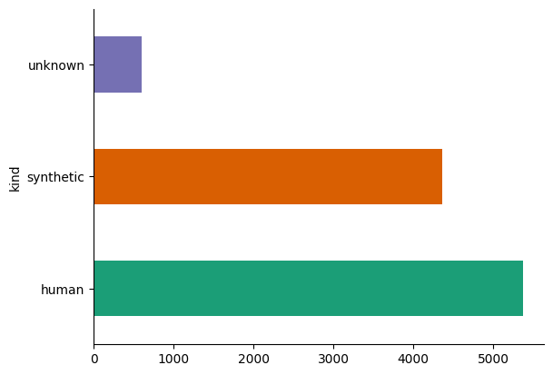

# Prompt Ranking Project

## What is it?

The Prompt Ranking Project is a pioneering community-driven initiative to explore the use of Argilla and Hugging Face Spaces for collaboratively creating impactful datasets. As part of the project, we built a dataset of 10k human and synthetic prompts, which users ranked by quality. This dataset serves various purposes: it can be used to train and evaluate language models on prompt ranking tasks or as seed data for generating synthetic prompts and completions by filtering those with the highest quality.

In addition, as the first crowdsourcing effort involving the community, it provides valuable insights into the behavior of annotators. This includes exploring the distribution of prompt rankings based on the source of the prompt, its type, length, or other features. We can also examine the agreement levels among annotators and identify factors that influence this agreement.

## How did we make it possible?

First, we created a prompt dataset with a mix of human and synthetic prompts from various sources. You can find the list of sources in the "Source Data" section [here](https://huggingface.co/datasets/DIBT/10k_prompts_ranked). Then, we set up an instance of Argilla in a Hugging Face Space to enable the annotation process. This preparation stage took around a week.

Finally, during the next two weeks, we invited the community to participate in the ranking process to evaluate their quality.

## How did people contribute?

The community contributed to the project by ranking the prompts in the dataset. For this, they just needed a Hugging Face account to log in to the Hugging Face Space where the Argilla instance was hosted and start ranking the prompts.

## Which tools were used?

For the prompt ranking project, we used two tools to help us manage the annotation process.

- [Argilla](https://github.com/argilla-io/argilla): an open-source data annotation tool that we used for the prompt ranking. Argilla has the option of using Hugging Face for authentication, which makes it easier for the community to contribute.
- [Hugging Face Spaces](https://huggingface.co/spaces): a platform for hosting machine learning applications and demos. We used Spaces to host the Argilla tool for prompt ranking.

## What did we achieve?

Thanks to the contribution of over 385 people, we were able to create version 1.0 of the [DIBT/10k_prompts_ranked](https://huggingface.co/datasets/DIBT/10k_prompts_ranked) dataset with 10,331 examples. 

Moreover, we could analyze the decision behavior of the annotators. Below, you can see that the human-generated prompts were ranked higher than the synthetic ones. This is an interesting observation that can be further explored in future research.

> The "unknown" kind is a result of the fact that the source of the prompt was not known for some of the prompts in the dataset.

Check the dataset [here](https://huggingface.co/datasets/DIBT/10k_prompts_ranked)! Don't miss it!