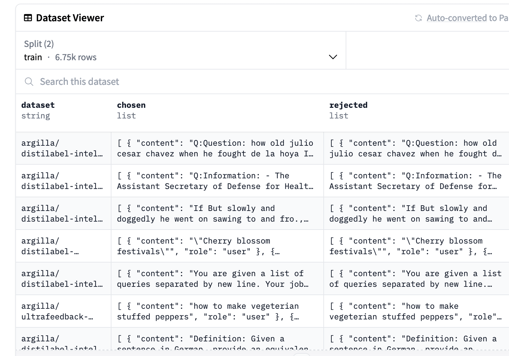
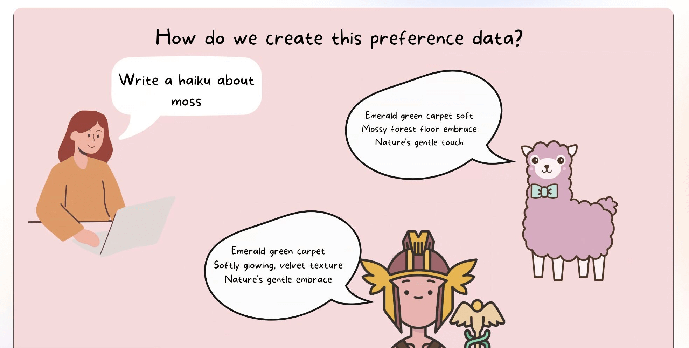
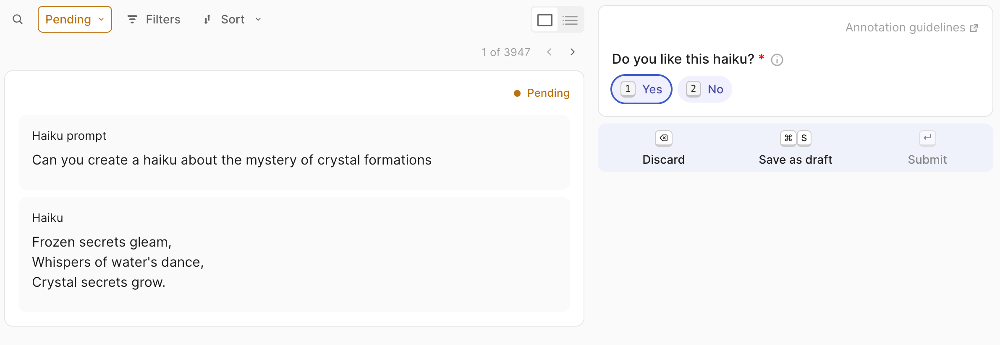

<p align="center">
  
</p>

# Creating a KTO Preference dataset

The goal of this project is to help foster a community of people building more KTO datasets for different languages or the domains they are interested in.

## Introduction

Here we walk through one possible approach to leveraging a community to collectively create a preference dataset. If you already now what a preference dataset is, differences between DPO/KTO and are just looking for a way to create one, you can skip to the next section.

### What is a preference dataset?

Preference tuning is a step often performed when creating a chat/instruction following model with the goal of more closely aligning the model's outputs with the "human preferences" (or more accurately one set of human preferences). Often this is done through some form of reinforcement learning. Increasingly instead of having a separate reward model, we can use a preference dataset to directly train the model. Two prominent approaches to this are:

- Direct Preference Optimization (DPO)
- Kahneman-Tversky Optimisation (KTO)

We won't dive into all of the technical details here but instead focus on what the data for both of these approaches look like. The overall steps are something like this:

- Have some prompts
- Generate responses to these prompts
- Rank/rate the responses to the prompts

We'll use the example of haiku here but this could be any kind of text generation task.

### DPO vs KTO

Whilst both DPO and KTO are methods for preference tuning (and sound like things that would be shouted at the end of a street fighter level), they differ in the kinds of data they require. DPO requires a preference dataset where we have two sets of responses with one "chosen" and one "rejected". We can take a look at a screenshot from a dataset server of a DPO dataset below:



As you can see, we have one column containing "chosen" responses and another containing "rejected" responses. This is the kind of data we would need for DPO. How would we collect this data once we have our candidate haiku responses? If we want to stick to using human feedback rather than a judge LM we would need to indicate their preferences between different haiku.

There are different ways we could do this. We could ask humans to rate the haiku on a scale of 1-5, we could ask them to pick their favorite haiku from a set of 5, we could ask them to rank the haiku from best to worst etc. One disadvantage of DPO is that generating this kind of data from humans is quite cognitively demanding. It can be hard to compare two things and say which one is better and even with an optimized interface, it can be quite time-consuming. This is where KTO can provide an alternative.

In contrast to DPO, KTO doesn't require two candidate responses i.e. "chosen" and "rejected". Instead, it can rely on a simple binary preference i.e. 👍👎. This is arguably much easier for an annotator to create.

### Why should we generate responses to prompts?

We could of course collect all of our preferences data by hand i.e. we could write a prompt like: "Write a recipe for banana bread" and then write two sets of responses one which we prefer over the other. However, this is time-consuming and not scalable. Instead, we can use a model to generate responses to our prompts and then use human feedback to determine which response we prefer. In our case, we can ask different LLMs to write haiku based on a prompt and then ask humans to rate the haiku.



### How can you contribute?

As part of Data Is Better Together, we're supporting the community in generating more KTO datasets for different languages or the domains they are interested in. If you would like to help, you can follow the steps below to generate a KTO dataset. There are already many communities working together on the Hugging Face Discord server, so you can also join the server to collaborate with others on this project 🤗.

## Project Overview

Here we will walk through a simple example of how you might create a KTO dataset using synthetic data and human feedback. We will use haiku as our example but this could be any kind of text generation task. 

### 1. Prerequisites

* A 🤗 Hugging Face account: We'll extensively use the Hugging Face Hub both to generate our data via hosted model APIs and to share our generated datasets. You can sign up for a Hugging Face account [here](https://huggingface.co/join).

* For the workflow we describe here, we assume you already have a dataset of prompts. This [notebook](https://github.com/davanstrien/haiku-dpo/blob/main/01_generate_haiku_prompts.ipynb) shows how you could generate a dataset of haiku prompts. This approach could be adapted to any kind of text-generation task. The [instruction generation](https://distilabel.argilla.io/latest/tutorials/create-a-math-preference-dataset/#instruction-generation) section of this Distilabel tutorial provides a good overview of how you might generate a dataset of prompts for a different kind of text generation task.

### 2. Produce generations with various open models

We will use [Distilabel](https://github.com/argilla-io/distilabel) to generate our haiku responses based on our initial prompt dataset. To generate the dataset, we will use the following models:

- [NousResearch/Nous-Hermes-2-Yi-34B](https://huggingface.co/NousResearch/Nous-Hermes-2-Yi-34B)
- [mistralai/Mistral-7B-Instruct-v0.2](https://huggingface.co/mistralai/Mistral-7B-Instruct-v0.2)
- [llama/Llama-2-70b-chat-hf](https://huggingface.co/llama/Llama-2-70b-chat-hf)

However, you could swap these out for other models depending on your goals, budget, the domain you are working in etc.

You will find the code to generate the haiku responses in [preference_gen.py](preference_gen.py).

#### Hosted Model APIs

We can use Hugging Face's free inference API to generate our haiku responses. This is a great way to get started with generating synthetic data. You can find more information on the supported models and how to use the API [here](https://huggingface.co/blog/inference-pro#supported-models).

One of our models, "NousResearch/Nous-Hermes-2-Yi-34B" is hosted using [Inference Endpoints](https://huggingface.co/inference-endpoints/dedicated) instead. In the code, this part is commented out so it should be possible to run the code without needing to set up dedicated inference endpoints.

> [!WARNING]
> We highly recommend you to use the serverless option. If you need to run an unavailable model, you can easily use them with [other frameworks](https://distilabel.argilla.io/latest/components-gallery/llms/) such as Ollama or vLLM.

#### The dataset produced

A single row from the dataset produced by this code looks like this:

```python
{
    "input": "Can you compose a haiku about the serenity of mountain peaks?",
    "generation_model": [
        "mistralai/Mistral-7B-Instruct-v0.2",
        "meta-llama/Llama-2-70b-chat-hf",
        "NousResearch/Nous-Hermes-2-Yi-34B",
    ],
    "generation_prompt": [
        "<s>[INST] <<SYS>>\nYou are a poet specialising in creating Haiku. \nYour haiku consist of three lines, with five syllables in the first line, seven in the second, and five in the third.\nBeyond being technically correct, your haiku should also be beautiful and meaningful. \nYou respond only with a haiku. You do not add anything else to your responses. \n\n<</SYS>>\n\nCan you compose a haiku about the serenity of mountain peaks? [/INST]",
        "<s>[INST] <<SYS>>\nYou are a poet specialising in creating Haiku. \nYour haiku consist of three lines, with five syllables in the first line, seven in the second, and five in the third.\nBeyond being technically correct, your haiku should also be beautiful and meaningful. \nYou respond only with a haiku. You do not add anything else to your responses. \n\n<</SYS>>\n\nCan you compose a haiku about the serenity of mountain peaks? [/INST]",
        "<|im_start|>system\nYou are a poet specialising in creating Haiku. \nYour haiku consist of three lines, with five syllables in the first line, seven in the second, and five in the third.\nBeyond being technically correct, your haiku should also be beautiful and meaningful. \nYou respond only with a haiku. You do not add anything else to your responses. \n\n<|im_end|>\n<|im_start|>user\nCan you compose a haiku about the serenity of mountain peaks?<|im_end|>\n<|im_start|>assistant\n",
    ],
    "raw_generation_responses": [
        " Peaceful summit rests,\nSky's reflection in still lake,\nSilence whispers on.",
        "  Snow-capped peaks rise high\nSilent, majestic, and serene\nNature's peaceful throne",
        "Mountain peaks, serene\nPeaceful silence, whispers breeze\nNature's tranquil song",
    ],
    "generations": [
        " Peaceful summit rests,\nSky's reflection in still lake,\nSilence whispers on.",
        "  Snow-capped peaks rise high\nSilent, majestic, and serene\nNature's peaceful throne",
        "Mountain peaks, serene\nPeaceful silence, whispers breeze\nNature's tranquil song",
    ],
}
```

As you can hopefully see, we have a single prompt and three haiku responses. We also have the model that generated each haiku response. This kind of data could be used to generate both a DPO and KTO dataset. We will focus on KTO here.

### I'm GPU-poor, can I still get involved?

Yes! The example scripts in this repository use Hugging Face Inference Endpoints for the inference component. This means you can run the scripts on your local machine without needing a GPU. We can provide you with GPU grants to run the `distilabel` script if you need them. Please reach out to us on the Hugging Face Discord server if you need a GPU grant. **Note**: We will want to ensure that you have a plan for how you will use the GPU grant before providing it, in particular, we'll want to see that you have set up an Argilla Space for your project already and have already done some work to identify the language you want to work on and the models you want to use.

## 3. Create a preference dataset annotation Space in Argilla hosted on Spaces with HF authentication

Hugging Face Spaces offer a simple way to host ML demo apps directly on your profile or your organization’s profile. [Argilla](https://argilla.io/) is a powerful data annotation tool that is integrated strongly with Hugging Face Spaces and other parts of the Hugging Face ecosystem. 


The [create_preference_task.ipynb](create_preference_task.ipynb) notebook shows how you could create a preference dataset annotation Argilla Space that anyone with a Hugging Face account can contribute to. This is a great way to collect human feedback on your synthetic data.

This will create a task that looks like this:



## Next steps

The current notebooks and code currently only show how to generate the synthetic data and create a preference dataset annotation Space. The next steps would be to collect human feedback on the synthetic data and then use this to train a model. We will cover this in a future notebook.