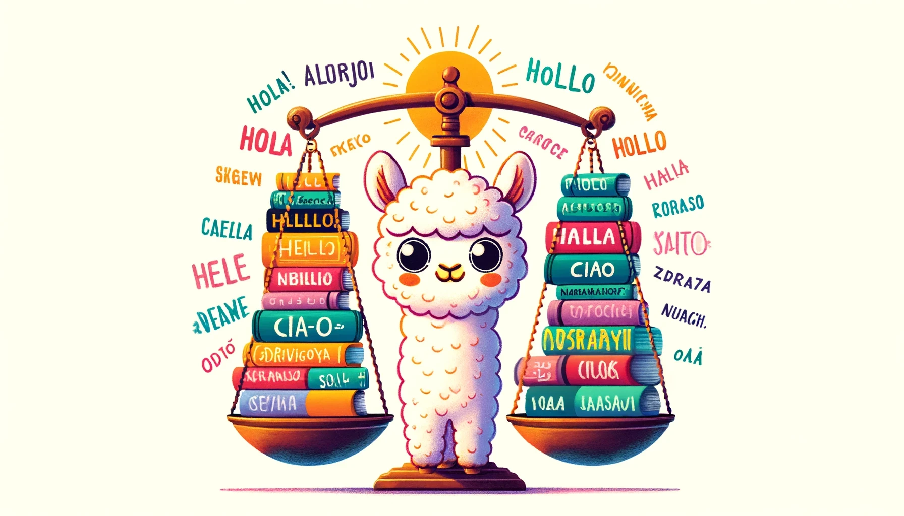

  

# Generating DPO/ORPO datasets for more languages

Currently, many languages do not have DPO datasets openly shared on the Hugging Face Hub. The goal of this project is to help foster a community of people building more DPO datasets for different languages.

## tl;dr what is the output of this project?

- An Argilla Interface for ranking responses generated by a human Aya annotator and a generated response. See the [aya_dutch_dpo](https://dibt-demo-argilla-space.hf.space/dataset/f47eac1c-8763-4513-ab02-b08eb66f7f65/annotation-mode)example.
- A "raw dataset" with LLM feedback for each prompt. See the [DIBT/aya_dutch_dpo_raw](https://huggingface.co/datasets/DIBT/aya_dutch_dpo_raw) for an example.
- A growing dataset with human-verified preferences for each response. See the [DIBT/aya_dutch_dpo](https://huggingface.co/datasets/DIBT/aya_dutch_dpo) for an example dataset.

## Creating a DPO/ORPO dataset for a new language

[Aya](https://cohere.com/blog/aya-multilingual), an open science initiative to accelerate multilingual AI progress, has released a dataset of human-annotated prompt-completion pairs across 71 languages. We can use this dataset to generate DPO/ORPO datasets for languages for which they don't currently exist.

Here are the steps we'll take to generate a DPO/ORPO dataset for a new language:

- start from the [CohereForAI/aya_dataset](https://huggingface.co/datasets/CohereForAI/aya_dataset)
- filter the Aya dataset to the language you are focusing on
- use [`distilabel`](https://github.com/argilla-io/distilabel) to generate a second response for each prompt in the filtered Aya dataset.
- (optional) send the generated dataset to [Argilla](https://argilla.io/) for annotation where the community can choose which response is better.
- (optional) train a model using the generated DPO/ORPO dataset and push forward the state of the art in your language 🚀🚀🚀

## What is Direct Preference Optimization (DPO/ORPO)?

Direct Preference Optimization (DPO) is a technique for training models to optimize for human preferences.

> [Direct Preference Optimization (DPO)](https://huggingface.co/papers/2305.18290) has emerged as a promising alternative for aligning Large Language Models (LLMs) to human or AI preferences. Unlike [traditional alignment methods](https://huggingface.co/blog/rlhf), which are based on reinforcement learning, DPO recasts the alignment formulation as a simple loss function that can be optimised directly on a dataset of preferences ${(x, y_w, y_l)}$, where $x$ is a prompt and $(y_w,y_l)$ are the preferred and dispreferred responses. [source](https://huggingface.co/blog/pref-tuning)

Or, in other words, to train a model using DPO you need a dataset of prompts and responses where one response is preferred over the other.

_Example of a preference tuning dataset. Each row contains a prompt and a "chosen" and "rejected" response._

## Why do we need DPO/ORPO datasets for more languages?

DPO datasets are a powerful tool for fine-tuning language models to generate responses that are more aligned with human preferences, so are a valuable resource for improving the quality of chatbots and other generative models. However, currently, there are only a few DPO datasets available for a limited number of languages. By generating more DPO datasets for different languages, we can help to improve the quality of generative models in a wider range of languages.

Recently, (Odds Ratio Preference Optimization) ORPO has been proposed as an alternative to DPO. ORPO is a novel approach to fine-tuning language models that incorporates preference alignment directly into the supervised fine-tuning (SFT) process by using the odds ratio to contrast favored and disfavored generation styles. By applying a minor penalty to the disfavored style during SFT, ORPO effectively guides the model toward the desired behavior without the need for an additional alignment step.

_tl;dr_: if you have a DPO-style dataset + a strong base model you can use ORPO to train a chat model. Recently Argilla, KAIST, and Hugging Face used this approach to train [HuggingFaceH4/zephyr-orpo-141b-A35b-v0.1](https://huggingface.co/HuggingFaceH4/zephyr-orpo-141b-A35b-v0.1) a very strong chat model using only 7k data preference pairs!

## How can I get involved?

As part of Data Is Better Together, we're supporting the community in generating more DPO/ORPO datasets for different languages. If you would like to help, you can follow the steps below to generate a DPO/ORPO dataset for a language that you are interested in. There are already many language communities working together on the Hugging Face Discord server, so you can also join the server to collaborate with others on this project 🤗.

## Instructions

You can find more detailed instructions on how to generate a DPO/ORPO dataset for a new language in the [instructions](./instructions.md).
