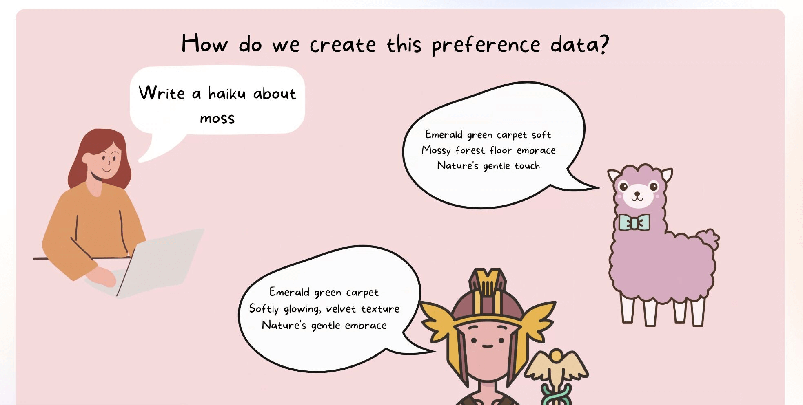
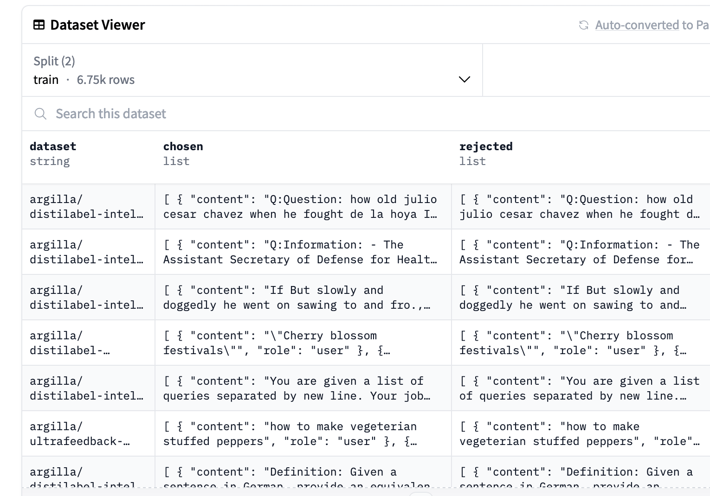

# Creating a KTO Preference dataset

Here we walk through one possible approach to leveraging a community to collectively create a preference dataset. If you already now what a preference dataset is, differences between DPO/KTO and are just looking for a way to create one, you can skip to the next section.

## What is a preference dataset?

Preference tuning is a step often performed when creating a chat/instruction following model with the goal of more closely aligning the model's outputs with the "human preferences" (or more accurately one set of human preferences). Often this is done through some form of reinforcement learning. Increasingly instead of having a separate reward model, we can use a preference dataset to directly train the model. Two prominent approaches to this are:

- Direct Preference Optimization (DPO)
- Kahneman-Tversky Optimisation (KTO)

We won't dive into all of the technical details here but instead focus on what the data for both of these approaches look like. The overall steps are something like this:

- Have some prompts
- Generate responses to these prompts
- Rank/rate the responses to the prompts

## Generating responses to prompts

We could of course collect all of our preferences data by hand i.e. we could write a prompt like: "Write a recipe for banana bread" and then write two sets of responses one which we prefer over the other. However, this is time-consuming and not scalable. Instead, we can use a model to generate responses to our prompts and then use human feedback to determine which response we prefer. In our case, we can ask different LLMs to write haiku based on a prompt and then ask humans to rate the haiku.

## DPO vs KTO

Whilst both DPO and KTO are methods for preference tuning (and sound like things that would be shouted at the end of a street fighter level), they differ in the kinds of data they require. DPO requires a preference dataset where we have two sets of responses with one "chosen" and one "rejected". We can take a look at a screenshot from a dataset server of a DPO dataset below:

As you can see, we have one column containing "chosen" responses and another containing "rejected" responses. This is the kind of data we would need for DPO. How would we collect this data once we have our candidate haiku responses? If we want to stick to using human feedback rather than a judge LM we would need to indicate their preferences between different haiku. 

There are different ways we could do this. We could ask humans to rate the haiku on a scale of 1-5, we could ask them to pick their favorite haiku from a set of 5, we could ask them to rank the haiku from best to worst etc. One disadvantage of DPO is that generating this kind of data from humans is quite cognitively demanding. It can be hard to compare two things and say which one is better and even with an optimized interface, it can be quite time-consuming. This is where KTO can provide an alternative.

In contrast to DPO, KTO doesn't require two candidate responses i.e. "chosen" and "rejected". Instead, it can rely on a simple binary preference i.e. 👍👎. This is arguably much easier for an annotator to create.

## 1. Prerequisites

- Prompt data: https://github.com/davanstrien/haiku-dpo/blob/main/01_generate_haiku_prompts.ipynb
## 2. Produce generations with various open models

We will use [Distilabel](https://github.com/argilla-io/distilabel) to generate our haiku responses based on our initial prompt dataset. To generate the dataset, we will use the following models:

- [NousResearch/Nous-Hermes-2-Yi-34B](https://huggingface.co/NousResearch/Nous-Hermes-2-Yi-34B)
- [mistralai/Mistral-7B-Instruct-v0.2](https://huggingface.co/mistralai/Mistral-7B-Instruct-v0.2)
- ['llama/Llama-2-70b-chat-hf'](https://huggingface.co/llama/Llama-2-70b-chat-hf)

However, you could swap these out for other models depending on your goals, budget, the domain you are working in etc. 

## 3. Create a preference dataset annotation Space in Argilla hosted on Spaces with HF authentication

